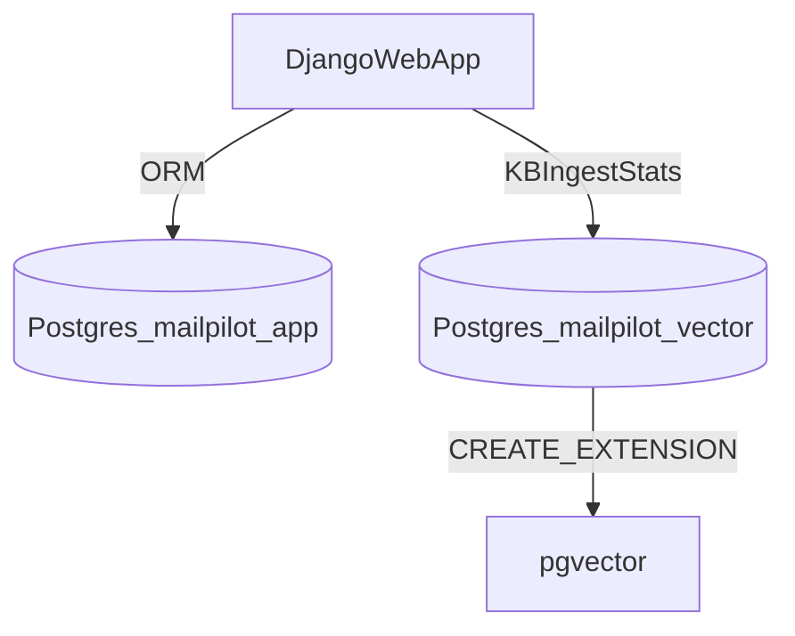

## ব্যবহারকারীর লক্ষ্য (নিশ্চিত করা হয়েছে)
- **Full site DB**: PostgreSQL (SQLite নয়)।
- **Knowledge Base**: PostgreSQL + **pgvector**।
- **Multi-tenant KB**: প্রতিটি user-এর knowledge **আলাদা** থাকবে (কোনো user অন্য user-এর chunk দেখতে পারবে না)।
- **Docker চালালে data safety**: container recreate হলেও DB data থাকবে; migration শুধু schema/নতুন সারি **যোগ** করবে—পুরনো ডাটা “নিজে থেকেই” মুছে যাবে না (নিচের “বিপদজনক অপারেশন” ছাড়া)।

## বর্তমান অবস্থা (কোডবেস থেকে)
- Django main DB এখন SQLite:

```71:76:C:\Users\User\Desktop\office\MailPilot\mailpilot\settings.py
DATABASES = {
    "default": {
        "ENGINE": "django.db.backends.sqlite3",
        "NAME": BASE_DIR / "data" / "django.sqlite3",
    }
}
```

- KB vector store এখন **stub/shim**—DB তে persist করে না:

```15:40:C:\Users\User\Desktop\office\MailPilot\email_automation\kb\store.py
class VectorStore:
    """Minimal vector store shim (no external DB required)."""

    def upsert_document_with_chunks(...):
        cnt = len(list(chunks))
        self._stats.documents += 1
        self._stats.chunks += cnt

    def stats(self) -> dict[str, Any]:
        return {"documents": int(self._stats.documents), "chunks": int(self._stats.chunks)}
```

- Per-user wiring ইতিমধ্যে আছে: `VectorStore(..., tenant_id=str(user.id))` (`core/views.py`)। pgvector implementation এ **tenant_id কে সব SQL এ বাধ্যতামূলক** করলেই user-wise isolation পূর্ণ হবে।

## আর্কিটেকচার সিদ্ধান্ত (প্রস্তাবিত ডিফল্ট)
একই Docker Postgres সার্ভারে **দুইটা আলাদা database** (isolation ভালো, backup/restore সহজ):
- **`mailpilot_app`**: Django `DATABASES.default`
- **`mailpilot_vector`**: `Settings.VECTOR_DB_DSN` / per-user `UserMailSettings.settings_json["VECTOR_DB_DSN"]`



**Option A (এক DB তে সব)**: সম্ভব, কিন্তু vector টেবিল ও app টেবিল একসাথে backup/restore হবে—আপনার “KB আলাদা” চাহিদার তুলনায় কম পরিষ্কার।

## Implementation plan (কোড + কনফিগ)

### 1) PostgreSQL main DB (Django)
- **Change**: [`mailpilot/settings.py`](mailpilot/settings.py) এ `DATABASES` কে env-driven Postgres এ নেওয়া (`DATABASE_URL` বা `POSTGRES_*`)।
- **Prod নীতি**: SQLite fallback **বন্ধ** রাখা ভালো (ভুল env হলে silently SQLite এ চলে গেলে production incident হয়)।
- **Run**: `python manage.py migrate` (এটি সাধারণত **ডাটা মুছে না**; শুধু schema বদলায়)।

### 2) pgvector-backed KB store (persist + per-user)
- **Change**: [`email_automation/kb/store.py`](email_automation/kb/store.py) এ stub সরিয়ে psycopg3 দিয়ে `VECTOR_DB_DSN` connect।
- **Init**: `CREATE EXTENSION IF NOT EXISTS vector;`
- **Tables (খসড়া)**:
  - `kb_documents(tenant_id text, doc_id text, ... , metadata_json jsonb, updated_at timestamptz, PRIMARY KEY (tenant_id, doc_id))`
  - `kb_chunks(tenant_id text, doc_id text, chunk_id int, chunk_text text, embedding vector(n), metadata_json jsonb, PRIMARY KEY (tenant_id, doc_id, chunk_id))`
- **Indexing**: প্রথমে ingestion/stats stable করুন; পরে similarity search চালু হলে `hnsw`/`ivfflat` যোগ (embedding dim ও data volume অনুযায়ী)।
- **Embeddings**: [`email_automation/kb/embedder.py`](email_automation/kb/embedder.py) এখন stub; pgvector store `vector(n)` dimension `settings.EMBEDDING_DIM` এর সাথে মিলিয়ে validate করবে।

### 3) API surface
- [`core/views.py`](core/views.py) এর `_get_vector_store_for_user` unchanged রাখা যাবে; store implementation বদলেই persist হবে।
- `api_kb_status` ইতিমধ্যে `VECTOR_DB_DSN` gate করে—DSN না থাকলে configured=false (expected)।

### 4) Docker dev (data মুছবে না এটা কীভাবে নিশ্চিত হবে)
- **Named volume** (`volumes: mailpilot_pg_data:/var/lib/postgresql/data`) ব্যবহার করুন—container delete/recreate হলেও data volume এ থাকে।
- **Init script** (`docker-entrypoint-initdb.d/`): প্রথম boot এ একবার—`CREATE DATABASE mailpilot_app;`, `CREATE DATABASE mailpilot_vector;`, প্রয়োজনে role/grant, এবং `mailpilot_vector` এ `CREATE EXTENSION vector;`।
- **বিপদজনক কমান্ড (এগুলোই data “মুছে” দেয়)**:
  - `docker compose down -v` (volume delete)
  - volume manually delete করা
  - DB এ `DROP TABLE`/`TRUNCATE`/`DROP DATABASE` চালানো
  - migration এ destructive operation (কলাম drop) ছাড়া Django migrate সাধারণত wipe করে না—তবু risky migration এ আগে backup

### 5) SQLite → PostgreSQL: পুরনো Django data নিয়ে যাওয়া (one-time)
SQLite এ ইতিমধ্যে user/settings থাকলে:
- `python manage.py dumpdata` (প্রয়োজনে app-wise) → JSON
- Postgres up + `migrate`
- `python manage.py loaddata` (বা selective import)
- **KB vector data**: বর্তমান stub থাকায় আসলে persisted vector chunks নেই—cutover এর পর নতুন করে ingest করতে হতে পারে (এটা expected)।

### 6) Git hygiene
- `__pycache__`, `*.pyc`, `data/django.sqlite3`, wal/shm—commit না করা ভালো; `.gitignore` আপডেট।

## Test plan
- **Django**: migrate, login, admin, মূল pages।
- **KB isolation**: দুই user দিয়ে ingest → অন্য user দিয়ে stats/query করলে count/rows না মিলা।
- **Persistence**: container restart এর পর `documents/chunks` count একই থাকা।
- **Regression**: `VECTOR_DB_DSN` খালি থাকলে API graceful error (existing behavior)।

## Production note (সংক্ষেপে)
- Dev/QA: Docker + volume ঠিক আছে।
- Prod: **Managed Postgres** + automated backup + restore test; Dockerized Postgres prod এ সম্ভব কিন্তু operability বেশি।
