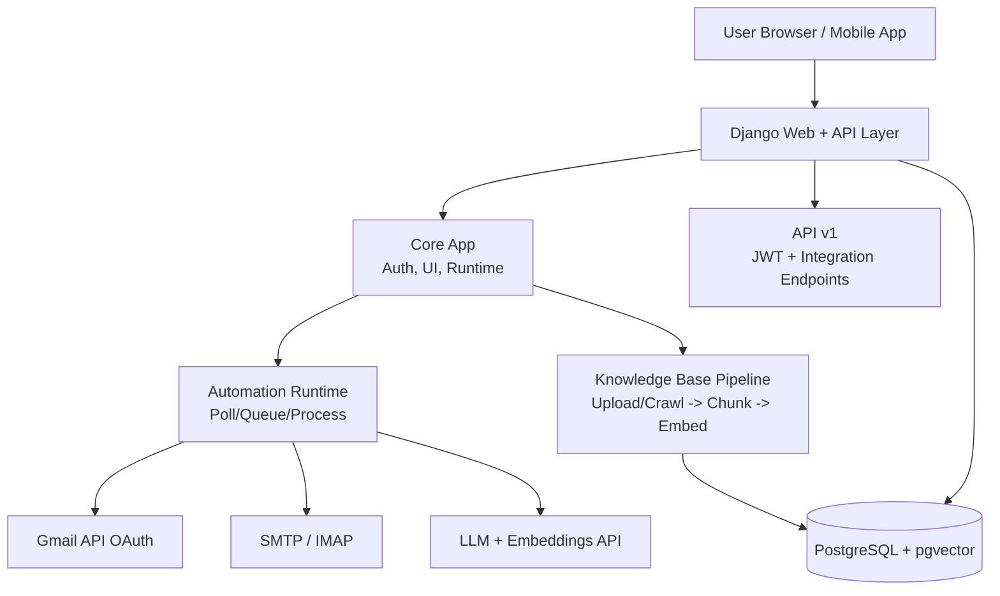

# MailPilot

MailPilot is a Django-based email automation platform. It connects with Gmail API or SMTP/IMAP, polls inbox messages, runs AI-assisted processing, and uses an optional Knowledge Base (RAG) powered by PostgreSQL + pgvector for grounded responses.

## Project Overview

- **Backend:** Django app (`core`, `api`) with REST APIs and server-rendered web pages.
- **Email integration:** Gmail OAuth + Gmail API, plus SMTP/IMAP fallback.
- **Automation runtime:** Background mail polling worker (in-process scheduler or Celery, based on env config).
- **Knowledge Base:** JSON upload / website crawl -> chunking -> embeddings -> pgvector storage.
- **Frontend:** Django templates for setup, dashboard, profile, and settings.

## Project Architecture Diagram



## Features

- **User auth and account flows**
  - Signup/login/logout
  - Password reset flow
  - Profile and settings pages
- **Mailbox connectivity**
  - Gmail OAuth connect/disconnect
  - SMTP connection test/status/disconnect
  - IMAP inbox polling for SMTP mode
- **Automation workflows**
  - Manual trigger for mail poll
  - Pending task/queue status endpoints
  - Health endpoint (`/healthz`) for runtime state
- **Knowledge Base (RAG)**
  - Upload JSON and ingest
  - Crawl website pages and ingest
  - Status/clear/export/replace operations (legacy + v1 API)
  - Embedding storage in pgvector-enabled PostgreSQL
- **Developer and client APIs**
  - Versioned REST API (`/api/v1/`)
  - JWT token auth for API clients
  - OpenAPI schema + Swagger + ReDoc docs

## Quick Start (Windows)

### 1) Prerequisites

- Python 3.10+
- Docker + Docker Compose
- Git (recommended)

Verify:

```powershell
docker --version
docker compose version
python --version
pip --version
```

### 2) Clone and enter project

```powershell
git clone <your-repo-url> MailPilot
cd MailPilot
```

### 3) Create virtual environment and install dependencies

```powershell
python -m venv .venv
.venv\Scripts\activate
pip install -r requirements.txt
```

### 4) Configure environment

Copy `.env.example` to `.env` and set values.

Minimum required:

```env
DJANGO_DEBUG=true
DJANGO_SECRET_KEY=<generate-secret>
DJANGO_ALLOWED_HOSTS=127.0.0.1,localhost

DJANGO_DB_ENGINE=django.db.backends.postgresql
DJANGO_DB_HOST=127.0.0.1
DJANGO_DB_PORT=5432
DJANGO_DB_NAME=mailpilot
DJANGO_DB_USER=mailpilot_user
DJANGO_DB_PASSWORD=mailpilot_password

VECTOR_DB_DSN=
LLM_API_KEY=<optional-but-recommended>
EMBEDDING_MODEL=text-embedding-3-small
EMBEDDING_DIM=1536
```

Generate Django secret key:

```powershell
python -c "import secrets; print(secrets.token_urlsafe(48))"
```

## Database Setup

MailPilot expects PostgreSQL and uses pgvector for KB embeddings.

### Option A (Recommended): PostgreSQL + pgvector via Docker

From project root:

```powershell
docker compose up -d
docker compose ps
docker compose logs -n 80 db
```

Default DB values (from compose):

- Host: `127.0.0.1`
- Port: `5432`
- DB: `mailpilot`
- User: `mailpilot_user`
- Password: `mailpilot_password` (change for production)

If port `5432` is busy:

1. Change `docker-compose.yml` mapping from `"5432:5432"` to `"5433:5432"`
2. Set `DJANGO_DB_PORT=5433` in `.env`

Verify DB connection:

```powershell
docker exec mailpilot-db psql -U mailpilot_user -d mailpilot -c "SELECT 1;"
```

### Option B: Native PostgreSQL

If using native PostgreSQL, run once in the target DB:

```sql
CREATE EXTENSION IF NOT EXISTS vector;
```

Then ensure `.env` `DJANGO_DB_*` points to that server.

## Run the Project

### 1) Apply migrations

```powershell
python manage.py migrate
```

### 2) Create admin user (optional but recommended)

```powershell
python manage.py createsuperuser
```

### 3) Start app (development/local)

```powershell
python manage.py runserver 0.0.0.0:8011
```

Open:

- `http://127.0.0.1:8011/`

### 4) Start app with Waitress (closer to production on Windows)

```powershell
powershell -ExecutionPolicy Bypass -File .\run_8011_waitress.ps1
```

## Post-Run Verification Checklist

- App loads in browser
- Login works
- `/healthz` returns `ok: true`
- KB ingest creates rows:

```sql
SELECT COUNT(*) FROM mailpilot_kb_chunks;
```

## API Docs

- OpenAPI schema: `/api/schema/`
- Swagger UI: `/api/docs/`
- ReDoc: `/api/redoc/`

## Important Notes

- Never commit real `.env` or credentials.
- For production, set:
  - `DJANGO_DEBUG=false`
  - strong `DJANGO_SECRET_KEY`
  - proper `DJANGO_ALLOWED_HOSTS`
  - HTTPS/reverse proxy (IIS/ARR or Nginx)
- Configure regular DB backups before go-live.

## Additional Docs

- `docs/README_CLIENT_WINDOWS_DOCKER.md` (client deployment runbook)
- `docs/README_ENVIRONMENT_VARIABLES.md` (.env reference)
- `docs/README_BACKUPS.md` (backup strategy)
- `docs/README_TROUBLESHOOTING.md` (common fixes)
- `docs/kb-pgvector-setup.md` (pgvector details)
- `docs/HANDOVER.md` (handover checklist)

