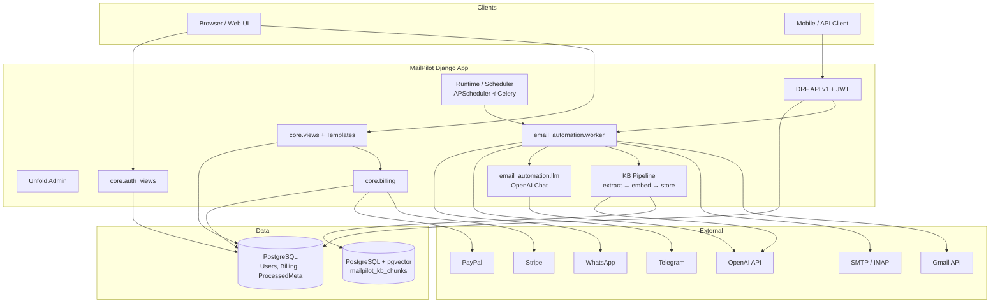
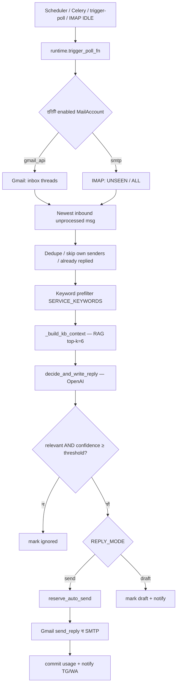
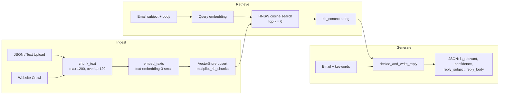
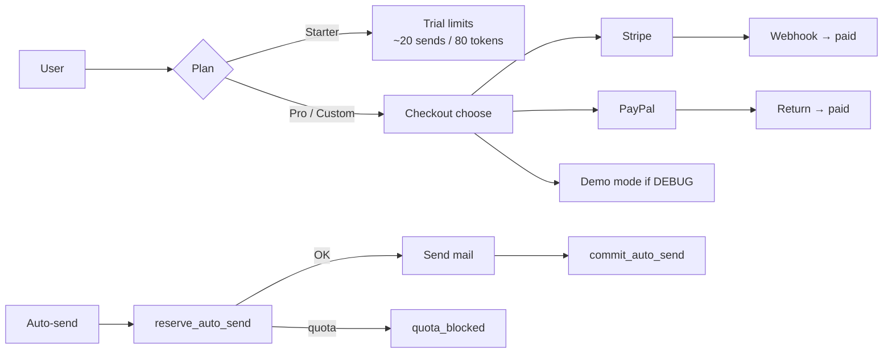

# MailPilot — Full System Architecture

এই ডকুমেন্টে MailPilot প্রজেক্টের সম্পূর্ণ সিস্টেম ডায়াগ্রাম, end-to-end প্রসেস ফ্লো, এবং RAG পাইপলাইনের বিশ্লেষণ আছে।
Ayu
---

## 1. প্রজেক্ট এক নজরে

**MailPilot** একটি Django 5 ভিত্তিক email-automation SaaS। ইউজার Gmail বা SMTP/IMAP inbox কানেক্ট করে; সিস্টেম মেইল পোলে করে, OpenAI দিয়ে classify করে, **RAG (pgvector)** দিয়ে knowledge base থেকে context নিয়ে grounded reply লেখে, এবং Stripe/PayPal দিয়ে billing গেট করে।

| লেয়ার       | টেকনোলজি                                            |
| ------------ | --------------------------------------------------- |
| Web          | Django ≥5, server-rendered templates (SPA নয়)      |
| API          | Django REST Framework + SimpleJWT + OpenAPI         |
| DB           | PostgreSQL                                          |
| Vector / RAG | **pgvector** (`mailpilot_kb_chunks`, HNSW cosine)   |
| LLM          | OpenAI Chat (`gpt-4o-mini` ডিফল্ট)                  |
| Embeddings   | OpenAI `text-embedding-3-small` (dim 1536)          |
| Email        | Gmail API + OAuth; SMTP send + IMAP poll; IMAP IDLE |
| Jobs         | APScheduler (ডিফল্ট) বা Celery + Redis              |
| Payments     | Stripe Checkout + webhooks; PayPal subscriptions    |
| Notify       | Telegram bot; WhatsApp Cloud API                    |
| Analytics    | Meta Pixel (মার্কেটিং পেজ)                          |

**ব্যবহার হয় না:** LangChain, Chroma, Pinecone, FAISS, Anthropic, FastAPI, React SPA।

---

## 2. ফোল্ডার স্ট্রাকচার

| পাথ                              | কাজ                                                                 |
| -------------------------------- | ------------------------------------------------------------------- |
| `manage.py`                      | Django CLI এন্ট্রি                                                  |
| `mailpilot/`                     | Settings, URLs, WSGI/ASGI, Celery                                   |
| `core/`                          | Auth, dashboard, billing, mail accounts, runtime, Telegram/WhatsApp |
| `api/` + `api/v1/`               | Versioned REST + JWT                                                |
| `email_automation/`              | Mail worker, Gmail/IMAP/SMTP, LLM, KB RAG                           |
| `email_automation/kb/`           | Chunk → embed → VectorStore                                         |
| `scraper/`                       | Website crawl → KB ingest                                           |
| `templates/`, `static/`          | SSR UI                                                              |
| `docs/`                          | Deploy, env, pgvector, handover                                     |
| `docker/` + `docker-compose.yml` | PostgreSQL + pgvector                                               |

---

## 3. System Diagram (পূর্ণ আর্কিটেকচার)

### কম্পোনেন্ট ম্যাপ

1. **Browser / Mobile** — ইউজার ইন্টারফেস
2. **Django Web + Templates** — ল্যান্ডিং, dashboard, setup
3. **DRF API v1 + JWT** — মোবাইল/ক্লায়েন্ট API
4. **Runtime / Scheduler** — মেইল পোল ট্রিগার
5. **Mail Worker** — পোল → ফিল্টার → RAG → LLM → send/draft
6. **KB Pipeline** — upload/crawl → chunk → embed → pgvector
7. **LLM Service** — relevance + reply JSON
8. **PostgreSQL** — অ্যাপ ডেটা
9. **pgvector** — KB embeddings (প্রায়ই একই DB)
10. **Gmail / SMTP+IMAP** — মেইল ট্রান্সপোর্ট
11. **Stripe / PayPal** — পেমেন্ট
12. **Telegram / WhatsApp** — নোটিফিকেশন + চ্যাট অ্যাসিস্ট্যান্ট

---

## 4. End-to-End প্রসেস (First → Last)

### 4.1 Signup → Plan → Inbox → Auto-Reply

| ধাপ | কী হয়                                                    | কোথায়                              |
| --- | --------------------------------------------------------- | ----------------------------------- |
| 1   | ইউজার `/signup` করে → Django `User` তৈরি                  | `core/auth_views.py`                |
| 2   | অটো `UserSubscription` (Starter plan) তৈরি                | `core/billing.py`                   |
| 3   | Login → `/dashboard` (staff হলে `/admin`)                 | session auth                        |
| 4   | (ঐচ্ছিক) Pro/Custom আপগ্রেড → Stripe/PayPal/demo checkout | `/billing/*`                        |
| 5   | `/setup` এ `MailAccount` তৈরি: Gmail OAuth বা SMTP/IMAP   | `core/mail_accounts.py`             |
| 6   | Keywords, `REPLY_MODE` (send/draft), threshold সেট        | `UserMailSettings` / account config |
| 7   | (ঐচ্ছিক) KB upload বা website crawl → embeddings          | `/api/kb/*`, `email_automation/kb/` |
| 8   | Scheduler/Celery/IDLE মেইল পোল শুরু করে                   | `core/runtime.py`                   |
| 9   | Keyword filter → RAG context → LLM decide+write           | `worker.py`, `llm.py`               |
| 10  | Send হলে billing reserve → send → commit usage            | `core/billing.py`                   |
| 11  | Telegram/WhatsApp নোটিফাই (plan অনুযায়ী)                 | `core/telegram_*`, `whatsapp_*`     |

### 4.2 মেইল প্রসেসিং ফ্লো (বিস্তারিত)

**সংক্ষেপে ধাপগুলো:**

1. **Poll start** — APScheduler interval, Celery beat, ম্যানুয়াল `/api/trigger-poll`, বা IMAP IDLE।
2. প্রতিটি enabled **MailAccount** এর জন্য inbox পড়া।
3. **Gmail:** ~৪০টি thread → সর্বশেষ inbound unprocessed মেসেজ।
4. **IMAP:** UNSEEN (fast) বা ALL (full poll)।
5. `StateStore` (`ProcessedMeta`) দিয়ে message **claim/dedupe**।
6. নিজের পাঠানো / আগে reply করা thread স্কিপ।
7. **SERVICE_KEYWORDS** দিয়ে প্রিফিল্টার।
8. Subject+body দিয়ে **RAG retrieve** → `kb_context` স্ট্রিং।
9. OpenAI দিয়ে **classify + reply draft** (JSON)।
10. Relevant + confidence ≥ `RELEVANCE_THRESHOLD` হলে send বা draft।
11. Send পাথে: token/daily limit **reserve** → পাঠানো → **commit**।

**মূল ফাইল:**  
`core/runtime.py`, `email_automation/worker.py`, `gmail_client.py`, `imap_mailbox.py`, `smtp_client.py`, `core/state_store.py`, `core/imap_idle.py`।

---

## 5. RAG System — বিশ্লেষণ

### 5.1 RAG আছে কি?

**হ্যাঁ — MailPilot-এ real RAG পাইপলাইন আছে।**

এটি LangChain/Chroma নয়; **কাস্টম পাইপলাইন**:

> Ingest → Chunk → OpenAI Embedding → PostgreSQL/pgvector → Cosine (HNSW) Search → LLM Prompt-এ `KB_CONTEXT` inject

### 5.2 RAG Architecture Diagram

### 5.3 Ingest (Knowledge Base ভর্তি)

| ধাপ                  | ফাংশন                                              | ফাইল                              |
| -------------------- | -------------------------------------------------- | --------------------------------- |
| Text/HTML/JSON parse | `documents_from_json_upload`, `html_to_text`       | `email_automation/kb/extract.py`  |
| Chunk                | `chunk_text` (max **1200** chars, overlap **120**) | একই                               |
| Crawl                | `crawl_site`                                       | `scraper/crawler.py`              |
| Embed                | `embed_texts` → `_embed_openai`                    | `email_automation/kb/embedder.py` |
| Store                | `VectorStore.upsert_document_with_chunks`          | `email_automation/kb/store.py`    |
| API                  | `/api/kb/*`, `/api/v1/kb/*`                        | `core/views.py`, `api/v1/`        |

- **Tenant isolation:** `tenant_id` = `user_id` বা `user_id:account_id`  
- **টেবিল:** `mailpilot_kb_chunks` — `(tenant_id, doc_id, chunk_id)` PK, `chunk_text`, `embedding vector(N)`, source/url/title/metadata  
- **Index:** HNSW cosine (`mailpilot_kb_chunks_embedding_hnsw_idx`)  
- API key না থাকলে **zero vectors** (খোঁজ খারাপ হয়) — fallback stub

### 5.4 Retrieve (রিপ্লাইয়ের সময়)

`email_automation/worker.py` → `_build_kb_context`:

1. Query = email subject + body
2. Query text embed করা
3. `VectorStore.search_by_embedding(..., limit=6)` — cosine distance (`<=>`)
4. Top chunks কে `[title | url | source] + text` ফরম্যাটে জোড়া
5. স্ট্রিংটা LLM-এ `KB_CONTEXT` হিসেবে যায়

### 5.5 Generate (LLM)

`email_automation/llm.py` → `decide_and_write_reply`:

- Model: `LLM_MODEL` বা ডিফল্ট `gpt-4o-mini`  
- Instruction: KB থাকলে **শুধু KB + email থেকে** ground করে লিখবে; ফ্যাক্ট invent করবে না  
- Output JSON: `is_relevant`, `confidence`, `reply_subject`, `reply_body`, `reason`

### 5.6 RAG কেন গুরুত্বপূর্ণ এখানে

| ছাড়া RAG                 | সহ RAG                                                           |
| ------------------------- | ---------------------------------------------------------------- |
| Generic / অস্পষ্ট রিপ্লাই | ব্যবসার নীতিমালা, প্রাইস, প্রোডাক্ট ডিটেইল থেকে grounded রিপ্লাই |
| Fake facts এর ঝুঁকি বেশি  | Prompt বলে: KB ছাড়া price/policy invent করো না                  |
| সব ইউজার একই জ্ঞান        | Tenant-wise আলাদা KB                                             |

### 5.7 RAG Setup নোট

- Docker image: `pgvector/pgvector:pg16` (`docker-compose.yml`)  
- একবার: `CREATE EXTENSION vector;`  
- বিস্তারিত: `[docs/kb-pgvector-setup.md](kb-pgvector-setup.md)`

---

## 6. Auth ফ্লো

| ফ্লো                    | বাস্তবায়ন                                        |
| ----------------------- | ------------------------------------------------- |
| Signup / Login / Logout | Session — `core/auth_views.py`                    |
| Password reset          | Email OTP (`PasswordResetOTP`)                    |
| Web API                 | JWT: `/api/v1/auth/token`, `/api/v1/auth/refresh` |
| Gmail OAuth             | শুধু mailbox কানেক্ট — অ্যাপ লগইন নয়             |
| Staff                   | Unfold `/admin/`                                  |

Google/Microsoft দিয়ে **অ্যাপ লগইন নেই** — শুধু Gmail mailbox OAuth।

---

## 7. Billing ফ্লো

- Entitlements: token, inbox, daily-send, KB limits; Telegram/WhatsApp Pro+  
- Ledger: `UsageEvent` (reserve / commit / fail)  
- মূল ফাইল: `core/billing.py`, `payment_gateway.py`, `paypal_api.py`, `billing_events.py`

---

## 8. Background Jobs

| ব্যাকএন্ড                | কখন                                   | কী করে                                   |
| ------------------------ | ------------------------------------- | ---------------------------------------- |
| **APScheduler**          | `CELERY_BROKER_URL` না থাকলে (ডিফল্ট) | Mail poll + Telegram poll                |
| **Celery Beat + Worker** | Redis broker সেট থাকলে                | `poll_all_users_mail` / `poll_user_mail` |
| **IMAP IDLE**            | APScheduler মোডে                      | Near-real-time নতুন মেইল                 |
| Manual                   | API                                   | `/api/trigger-poll`                      |

`WORKER_ONCE=true` থাকলে continuous scheduler বন্ধ।

---

